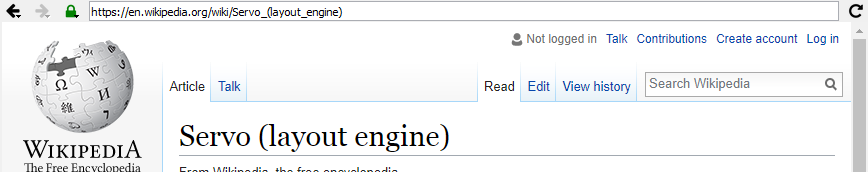
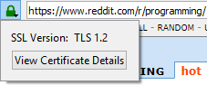
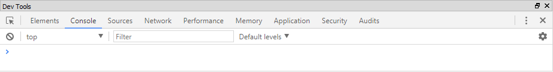

# Browser Usage

The central area of Doogie is the browser window which changes depending upon which browser is current in the
[page tree](page-tree). The top of the page tree has an address bar and buttons for navigating and reloading the page.
Hovering over a link will show the URL for the link at the bottom of the browser area.

## Navigation

In the top bar, there are buttons for navigating backwards and forwards which are disabled if there are no more pages in
that direction. By holding down the mouse button on either button, a list will appear that shows all pages that can be
jumped to. The back button may also be triggered by pressing `Ctrl+PgDn`, `Ctrl+Shift+PgUp`, or `Backspace` (while
an edit field is not focused in the browser). The front button may also be triggered by pressing `Ctrl+PgUp`,
`Ctrl+Shift+PgDn`, or `Shift+Backspace` (whild an edit field is not focused in the browser).

When there is not a page loading, there is a refresh button to the right of the address bar. Pressing this button will
refresh the page, utilizing the cache if available. This can also be triggered via `F5`. Pressing `Ctrl` while clicking
the button, pressing `Ctrl+F5`, or pressing `Ctrl+R` will do a refresh without utilizing the cache (i.e. a full reload).

If a page is loading, the refresh button becomes a stop button. Clicking this or pressing `Escape` will cause the page
to stop loading.

## Address Bar

The address bar is at the top of the browser. It contains the current URL of the page. The bar can be focused for edit
by clicking on it, pressing `Alt+2`, or pressing `Ctrl+D`.

While typing a URL, an autocomplete box appears with 10 matching entries based on what has been visited before. These
are ordered by a combination of most recent and most frequent visits. Simply use the arrow keys or the mouse to select
which autocomplete item to navigate to. Otherwise, press enter to attempt to navigate to the URL in the field.

An item also appears in the autocomplete for searching [DuckDuckGo](https://duckduckgo.com/) for the entered phrase. To
use another search engine, simply use the [!bang syntax](https://duckduckgo.com/bang).

## SSL/TLS Info

Once a page has finished loading, a lock icon will appear to the left of the address bar showing how secure the page is.
The lock has four states:

*  unlocked and grayed out - The page is not secured by HTTPS.
*  locked and green - The page is validly secured via HTTPS.
*  unlocked and orange - Only some of the page is secured via
  HTTPS.
*  locked and green - The page is on HTTPS but invalidly secured.

Unless the lock icon is grayed out, it can be clicked to see more SSL information such as the certificate itself.

## Find in Page

Pressing `Ctrl+F` in a page opens the find bar at the bottom of the page. Typing in this field highlights found items
and shows the total number of items. Clicking the down button or pressing `Enter` moves to the first item and
continually doing so `Enter` goes forward. Clicking the up button or pressing `Shift+Enter` goes backwards. To remove
the find bar, simply press `Escape` while in the find box.

## Zoom and Fullscreen

To zoom in on a page, press `Ctrl` and `+` (or `Ctrl` and `=`). This will zoom in the page by 10%. To zoom out by 10%,
press `Ctrl` and `-`. To reset the zoom back to the normal 100%, press `Ctrl` and `0`.

To fullscreen the current page, press `F11`. To exit fullscreen, press `F11` again or press `Escape`.

## Dev Tools

If the dev tools dock window is not open, pressing `F12` will open the window and open dev tools for the current page.
If the dev tools dock window is open, but dev tools is not open for the current page, pressing `F12` or clicking the
"open" button in the dock window will open dev tools for the current page. If the dev tools is visible and open for the
current page, pressing `F12` will close dev tools for all pages and close the dock window.