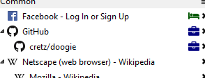
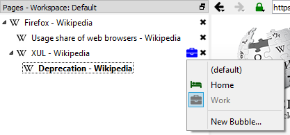
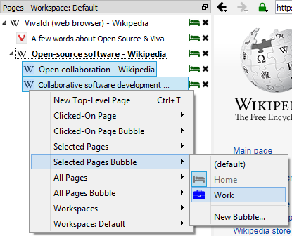
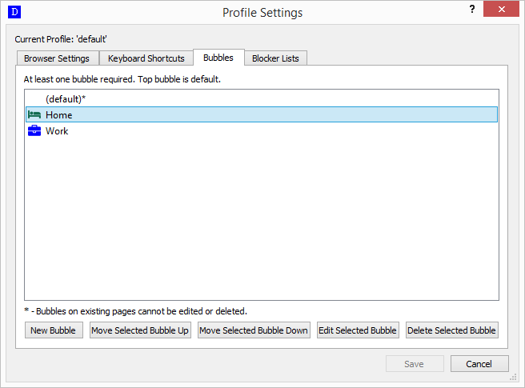
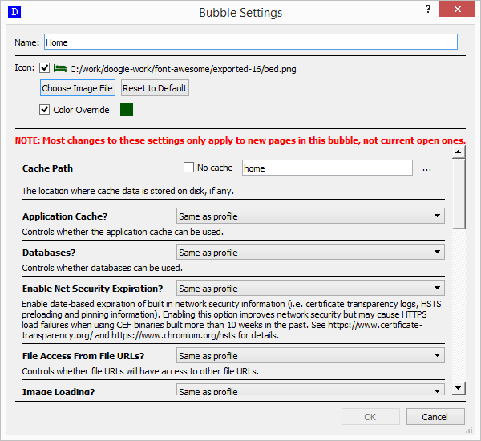

# Bubbles

A bubble is a context a page resides in. A bubble has its own settings including the cache path which means two pages
can be side-by-side in the page tree but open in different bubbles set to different paths meaning things like cookies
aren't shared. Or a bubble may have JavaScript disabled and a user can easily have the "no JS" bubble be the default and
switch to a more full-featured bubble as needed.

## On Page Tree

Each bubble has a name and may have an icon that identifies it. Every page is opened in a bubble. The default bubble
when Doogie is first installed is named "(default)" and has no icon. The icon for a page's bubble appears on the page
tree just to the left of the **X** close button. For example, if there is a bubble for "Home" that is a green bed icon
and another for "Work" that is a blue briefcase, here's how the pages might look opened in both:

By default, a page is opened in the bubble of its parent page. If there is no parent page, a bubble is opened in the
top-most bubble in the profile's bubble list (see [Management](#management)).

### Changing a Page's Bubble

To change a bubble for an individual page, right click the bubble icon (or where the icon would be if it existed) which
is just to the left of the **X** close button for the tree.

The currently selected bubble will be checked and not selectable. Select any other bubble to change it. To change the
page to a new bubble, click `New Bubble...` and the [settings](#settings) dialog will appear. Upon successful save of
the new bubble, the page will be changed to it.

Changing the bubble for multiple pages is also supported via [page actions](page-tree#page-actions). For example, to
change a bubble for several pages, select them and right-click.

This menu can be used the same way as the individual page bubble menu. The same applies to clicked-on page, current
page, and all pages via the page tree menu.

## Management

The `Bubbles` tab in the [profile settings dialog](general#profile-settings) is where bubbles are managed.

The top-most bubble is the bubble that top-level pages will be opened in by default. To move a bubble around in the
list, select it and click the button for moving it down or up.

Bubbles can be added, edited, or deleted here. Note, bubbles that currently have visible pages in them cannot be edited
or deleted until all of the pages within them are closed. A new bubble can be created with `New Bubble` or via the page
tree menu item. An eligible bubble can be edited by double clicking on it or clicking the `Edit Selected` button.

### Settings

The bubble's setting dialog appears when adding or editing a bubble.

The settings dialog includes a way to set the name and icon of the bubble. The name must be unique. The icon is
optional and, if present, a color override can be applied. All other settings are basically overrides for 
[profile settings](general#profile-settings).