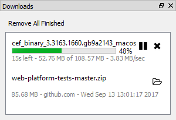
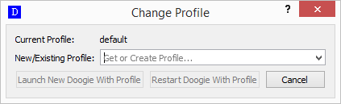
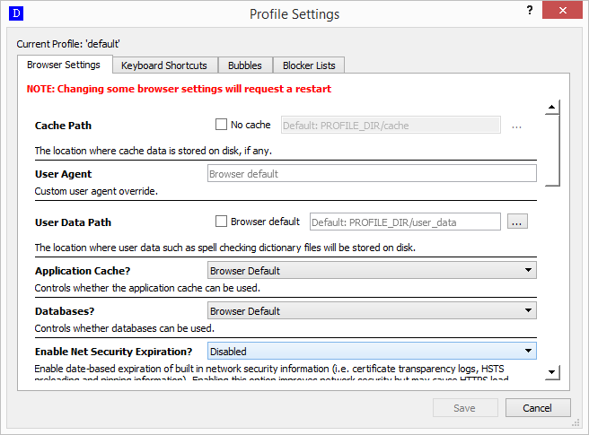

# General Usage

## Dock Windows

Tool windows in Doogie appear as dock windows. This includes the [page tree](page-tree), the downloads window, the logs
window, and more. Dock windows may be rearranged. They can be dragged to the borders of the application, just dragged
out to remain their own floating windows, or dragged on top of existing windows to make a tabbed view of multiple dock
windows.

Every time Doogie is closed, the arrangement of the windows is stored. Then when Doogie is started again, it is restored
the way it was when closed.

### Downloads

The downloads dock window shows all current and previous downloads. Clicking "Remove All Finished" removes all entries
that are not actively downloading. Downloads may be paused/resumed and can be canceled. A completed download will have a
folder icon next to it that, when clicked, will open the operating system's file browser to the directory where the
download was saved to.

### Logs

The logs window shows all internal logs Doogie. Currently this is not configurable but will be in the future.

### Request Blocker

The request blocker window shows all URL requests that were blocked either in the current page or in all pages. It shows
the information about each blocked request and can be sorted by any of the pieces of information.

In the upper right there is a checkbox for "Current Page" that, when checked, will only show blocked requests for the
current page. To the right of it there is a clear button that, when pressed, will clear the currently visible blocked
requests whether that is just for the current page or for all pages. Finally, on the far right is a settings button.
Clicking that opens the [blocker list settings](#blocker-lists) in the profile window.

## Profiles

Every Doogie instance is associated with a profile. By default, a "default" profile is used. Essentially a profile is
just a directory. A profile stores everything about Doogie except for dock window arrangement. Profiles are intended to
be used by different users. For different browsing contexts with the same user, consider [bubbles](bubble).

To change a profile, use the `Window` > `Profile` > `Change Profile` menu action. Since the entire Doogie process must
be associated with a profile, changing a profile requires either restarting Doogie or starting a new instance of Doogie.

There is an in-memory-only profile which will never store anything. This can be helpful for ephemeral browsing sessions
where no storage is desired.

### Profile Settings

A profile has many settings including cache paths, keyboard shortcuts, [bubbles](bubble), and blocker lists. These can
be edited via the profile settings dialog in the `Window` > `Profile` menu (except for the in-memory profile).

The settings dialog has four tabs:

#### Browser Settings

This has the common browser settings for the entire application. Many of these can be individually overridden in
[bubbles](bubble). Changing some of these at the profile level requires the application be restarted.

#### Keyboard Shortcuts

This has all keyboard shortcuts for the application. These can be changed by clicking the desired action to change. Then
an existing shortcut can be deleted. Also, a shortcut can be added by manually entering the key sequence in the field or
pressing `Record` and typing the sequence within a couple of seconds.

#### Bubbles

Bubbles are contextual browsing settings. Bubbles are described in detail in the [bubble](bubble) section. They can be
added, edited, or deleted in the profile settings dialog. Note, bubbles which have any open pages in them cannot be
edited or deleted until their pages are closed. Bubbles can be moved up or down which affects how they appear in the
bubble menu. The top-most bubble is the one top-level pages will be opened in by default. See
[bubble management](bubble#management) for more information.

#### Blocker Lists

This tab shows all loaded blocker lists, which ones are enabled, when the are refreshed, and more. Blocker lists use the
[Adblock Plus filter syntax](https://adblockplus.org/filters). They can be loaded from a file or from a URL.

A selected blocker list may be removed by clicking `Delete`. A reload can be forced on a selected blocker list by
clicking `Force Reload on Save`.