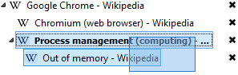
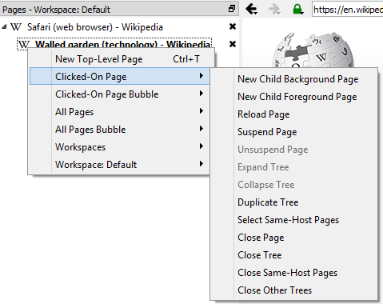

# Page Tree

The page tree is a dock window that shows all the open pages in a tree-style hierarchy. The tree pages can be opened,
moved around, closed, suspended, moved under separate workspaces or bubbles, etc.

## Navigation

The page tree has a "current" page which is signified by bolding the page's title. The current page is the one that will
be shown on screen. The current page can be changed simply by clicking a page.

To navigate to the next page visibly below the current page (i.e. not including any collapsed pages) or wrap around to
the top, press `Ctrl+Down` or `Ctrl+Tab`. To go above or wrap around to the bottom, press `Ctrl+Up` or `Ctrl+Shift+Tab`.
Note, these are the default shortcut keys for these actions and may be altered by the user.

## Selection

To select multiple tree pages, a normal rectangle drag can be used, starting by click-dragging off of any existing page.
A range of tree pages can be selected by selecting one and holding shift while selecting another. Similarly, multiple
individual tree pages may be selected by pressing ctrl while clicking them.

## Page Actions

When right-clicking, a context menu appears that allows you to create a new top-level page (see
[Adding Pages](#adding-pages)), manage workspaces (see [Workspaces](#workspaces)), and affect current pages. The list of
pages that can be affected can include the "Clicked-On Page", the "Current Page" (only if there was no clicked-on page),
"Selected Pages" (if applicable), and "All Pages". The actions include:

* **New Child Background Page** (single page only) - Create a new child page in the background
* **New Child Foreground Page** (single page only) - Create a new child page and navigate to it
* **Reload Page(s)** - Reload non-suspended page(s)
* **Suspend Page(s)** - Suspend page(s). See [Page Suspension](#page-suspension) section for more information.
* **Unsuspend Page(s)** - Unsuspend page(s). See [Page Suspension](#page-suspension) section for more information.
* **Expand Tree(s)** - Page(s) that have children will be expanded recursively
* **Collapse Tree(s)** - Page(s) that have children will be collapsed recursively
* **Duplicate Tree(s)** - Page tree(s) will be copied/recreated in the bottom of the tree
* **Select Same-Host Page(s)** (single page only) - Select all tree pages that have the same URL host
* **Close Page(s)** - Close page(s) and recursively close any children of collapsed pages. If the page is not collapsed,
  its children will be moved up a level.
* **Close Tree(s)** - Close tree(s) which includes all children regardless of expansion state
* **Close Same-Host Page(s)** - Same as selecting same-host pages then doing close page(s)
* **Close Other/Non-Selected Page(s)** - Same as close page(s) but for the other pages
* **Close Other/Non-Selected Tree(s)** Same as close tree(s) but for the other trees
* **Bubble** - Change the bubble for the page(s). See [Bubbles](bubble) for more information.

## Rearranging Pages

Pages may be moved simply by dragging them. Dragging a page will move all selected pages. The pages may be moved
adjacent (above or below) other pages or added as children of other pages.

Instead of moving, the pages may copied by holding `Ctrl` or `Alt` while releasing the drag. Copying consists of just
opening new pages with the same URLs.

Pages can be collapsed or expanded by clicking the collapse/expand icon to the left of the page title.

Pages can be dragged between workspaces as well. See the [Workspaces](#workspaces) section.

## Adding Pages

In addition to copying/duplicating pages, there are other ways to add them. The simplest is to use `Ctrl+T` which will
open a new page in the foreground at the bottom of the tree. Pressing `Ctrl+Shift+T` opens a new page in the foreground
as a child of the current one. Similarly double-clicking below all the pages in the tree will open a new top-level page
in the foreground, and holding `Ctrl` while doing this double-click will open a new child page in the foreground.

While browsing a page, clicking a link opens the link in that same page. Pressing `Shift` while clicking a link will open
the page as a new foreground top-level page. Pressing `Ctrl` while clicking a link will open the page as a new
background child. Pressing `Ctrl` and `Shift` while clicking a link will open the page as a new foreground child.

## Closing Pages

When a page is closed, its children are also closed if it is collapsed. If the page is expanded, the children are
instead moved up a level where the closed page used to be.

To close the current page, press `Ctrl+F4` or `Ctrl+W`. To close any page, simply click the **X** to the right of the
page title. To close multiple pages at once, click-drag across the **X** buttons of the pages to be closed. To close all
pages, press `Ctrl+Shift+F4` or `Ctrl+Shift+W`. A page may also be closed by pressing `Delete` after clicking it. After
selecting multiple pages, `Delete` can be used to close all of them.

## Page Suspension

Pages can be marked as suspended. A suspended page has all of its resources freed. It is shown as suspended by having
the page title grayed out.

A page is unsuspended by explicitly using the "unsuspend" action, or just pressing enter in the address bar. This action
simply loads the page using the URL as normal.

## Workspaces

Workspaces are groupings of hierarchical pages that can be closed and reopened at a later time. This is helpful for
contextual browsing where you can work where you left off.

All pages are opened in a workspace. If there is only one workspace open, it will be implicit and shown in the title for
the page tree dock window. When multiple workspaces are opened, workspaces will be shown distinctly and pages can be
dragged between them.

Workspaces are created or opened via the `Workspaces` context menu (accessed via right-click). They are named and the
name must be unique. All but one workspace can be closed via the right-click menu or the hamburger menu to the right of
the workspace name. The bottom-most workspace on the page tree is where top-level new pages are added.

The arrangement of pages beneath workspaces are automatically saved to the workspace. Using the right-click or hamburger
menu, workspaces can be closed and/or deleted. They can also be managed via the menu option.